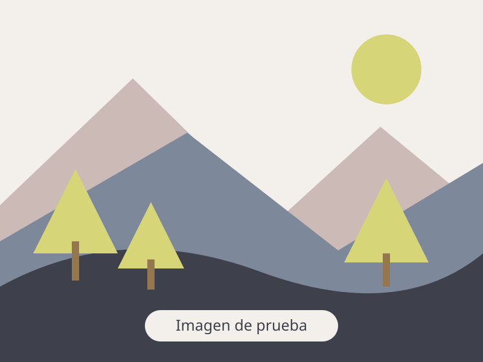

Actualmente participo en los siguientes proyectos de investigación:

## Futures4Forests

:::: {.project-entry}
::: {.project-visual}
<!-- Sustituye esta ruta por tu fotografía y actualiza el texto alternativo. -->
{.project-image fig-alt="Imagen provisional de Futures4Forests: ilustración de un paisaje forestal."}
:::

::: {.project-description}
**Learning from the past for redefining the trajectory of future forests**

Futures4Forests plantea aprender del pasado de los bosques para repensar sus trayectorias futuras. Dirijo este proyecto en la Universidad de Alcalá, con financiación del programa de Atracción de Talento César Nombela de la Comunidad de Madrid y un periodo de ejecución de 2025 a 2029.

[Más información · Universidad de Alcalá](https://www.uah.es/es/estudios/profesor/Veronica-Cruz-Alonso/)
:::
::::

## QueVADIS

:::: {.project-entry}
::: {.project-visual}
<!-- Sustituye esta ruta por tu fotografía y actualiza el texto alternativo. -->
{.project-image fig-alt="Imagen provisional de QueVADIS: ilustración de un paisaje forestal."}
:::

::: {.project-description}
**Diferencias de colonización de quercíneas coexistentes: desde las propiedades y la dispersión de las bellotas a la facilitación**

QueVADIS estudia por qué distintas especies de *Quercus* que conviven en la península ibérica difieren en su capacidad de colonizar nuevos espacios. Analiza la regeneración, las características y la dispersión de las bellotas, y el papel de los arbustos que favorecen el establecimiento de nuevos árboles, combinando datos existentes con experimentos de campo y laboratorio.

[Más información · Presentación del proyecto en la UPM](https://preweb.montes.upm.es/?p=6815)
:::
::::

## Sesgos en la restauración forestal

:::: {.project-entry}
::: {.project-visual}
<!-- Sustituye esta ruta por tu fotografía y actualiza el texto alternativo. -->
{.project-image fig-alt="Imagen provisional de Sesgos en la restauración forestal: ilustración de un paisaje forestal."}
:::

::: {.project-description}
**Identifying, quantifying, and accounting for biases in forest restoration**

Este proyecto analiza los sesgos de la investigación sobre restauración forestal que dificultan valorar su eficacia. Mediante la síntesis de la evidencia disponible y la colaboración de un equipo internacional, busca mejorar la base científica que orienta las decisiones de restauración. Cuenta con el apoyo de una Synthesis Grant de la British Ecological Society.

[Más información · British Ecological Society](https://www.britishecologicalsociety.org/content/our-synthesis-grantee-researches-forest-restoration-biases/)
:::
::::

## ForestAssembly

:::: {.project-entry}
::: {.project-visual}
<!-- Sustituye esta ruta por tu fotografía y actualiza el texto alternativo. -->
{.project-image fig-alt="Imagen provisional de ForestAssembly: ilustración de un paisaje forestal."}
:::

::: {.project-description}
**Compartiendo información de comunidades de especies forestales del planeta de forma ética y reproducible**

ForestAssembly reúne información sobre comunidades forestales para facilitar su estudio y el intercambio ético y reproducible de datos. Su base de datos incluye inventarios de vegetación en lugares afectados por talas, incendios y actividades agrícolas o ganaderas, que permiten explorar cómo cambia la composición de los bosques durante su recuperación.

[Título del proyecto · AEET](https://www.aeet.org/mm/file/Listado%20participantes%20PIs%20AEET_2023.pdf) · [La base de datos y su visualización · Universidad de Alcalá](https://ebuah.uah.es/dspace/handle/10017/62177)
:::
::::
